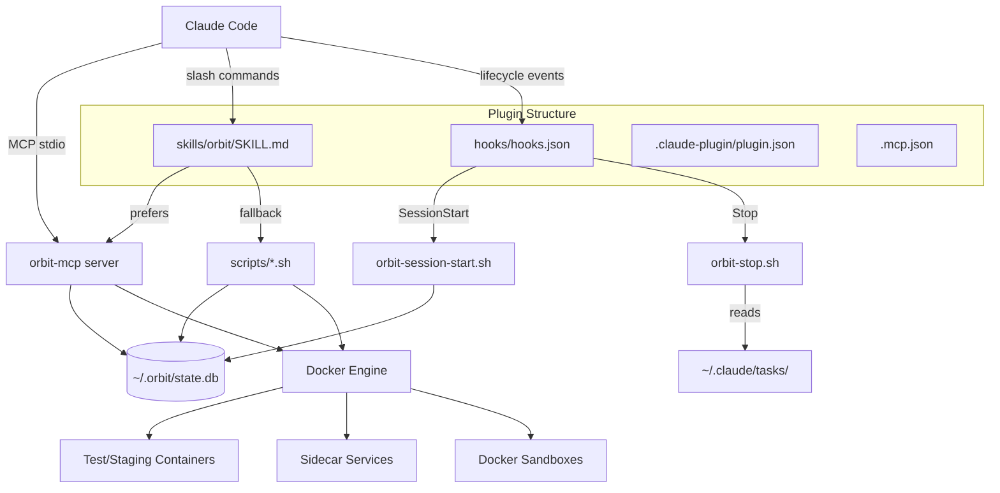
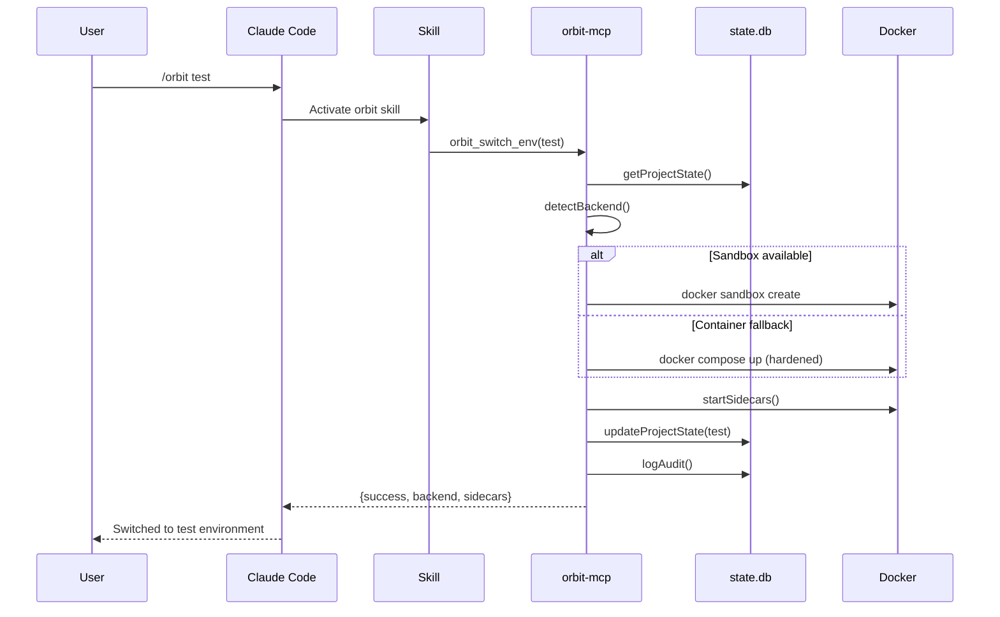

# Codebase Map

> Auto-generated by Mercator AI. Last mapped: 2026-02-13T18:55:51Z

## System Overview



## Directory Structure

```
orbit/                          # Claude Code plugin + npm package
+-- .claude-plugin/
|   +-- plugin.json             # Plugin manifest (name, version, metadata)
+-- .mcp.json                   # MCP server registration (uses CLAUDE_PLUGIN_ROOT)
+-- skills/orbit/
|   +-- SKILL.md                # /orbit command routing (MCP-first, bash fallback)
+-- hooks/
|   +-- hooks.json              # Hook event registration (SessionStart, Stop)
|   +-- orbit-session-start.sh  # Show current env on session start
|   +-- orbit-stop.sh           # Infer env from task keywords on stop
+-- orbit-mcp/                  # TypeScript MCP server (background daemon)
|   +-- src/
|   |   +-- index.ts            # Entry point, tool registry (6 tools)
|   |   +-- config.ts           # Path constants (~/.orbit/*)
|   |   +-- stateDb.ts          # SQLite abstraction (better-sqlite3)
|   |   +-- dockerManager.ts    # Async Docker orchestration
|   |   +-- containerFallback.ts # Hardened container security overlay
|   |   +-- sandboxDetector.ts  # Detect Docker Sandbox capabilities
|   |   +-- sandboxManager.ts   # Sandbox lifecycle (create/exec/stop/remove)
|   |   +-- sandboxPolicy.ts    # Network isolation policy (deny-all/allow/open)
|   |   +-- utils.ts            # isProjectInitialized, readProjectConfig
|   |   +-- tools/
|   |       +-- status.ts       # orbit_status: env + docker + sandbox state
|   |       +-- switchEnv.ts    # orbit_switch_env: dev/test/staging transitions
|   |       +-- getState.ts     # orbit_get_state: raw DB/registry queries
|   |       +-- sidecars.ts     # orbit_sidecars: list/start/stop services
|   |       +-- stopAll.ts      # orbit_stop_all: emergency stop
|   |       +-- sandbox.ts      # orbit_sandbox: direct sandbox management
|   +-- package.json            # @modelcontextprotocol/sdk, better-sqlite3, zod
|   +-- tsconfig.json           # ES2022, NodeNext, strict
+-- scripts/                    # Bash operations (sourced by skill + CLI)
|   +-- orbit-utils.sh          # Shared lib: ORBIT_ROOT/ORBIT_STATE, JSON, audit
|   +-- orbit-init.sh           # Project onboarding (.orbit/config.json + registry)
|   +-- orbit-test.sh           # Docker test runner (--fresh flag, sidecars)
|   +-- orbit-staging.sh        # Production-mimic container (NODE_ENV=production)
|   +-- orbit-status.sh         # Environment + Docker + audit display
|   +-- orbit-sidecars.sh       # Sidecar list/start/stop via compose profiles
|   +-- check-docker.sh         # Docker availability check (json/status/check)
|   +-- check-parity.sh         # Toolchain version comparison
|   +-- detect-project.sh       # Infer type from markers (node/python/go/rust)
|   +-- detect-workspace.sh     # Monorepo detection (npm/pnpm/cargo/go)
|   +-- install.sh              # One-time setup (~/.orbit/, MCP, hooks)
+-- docker/                     # Container definitions
|   +-- docker-compose.yml      # Profile-based isolation (6 sidecars, 4 runners)
|   +-- node.dockerfile         # npm/pnpm/yarn auto-detect
|   +-- python.dockerfile       # pip + pytest
|   +-- go.dockerfile           # go mod + go test
|   +-- rust.dockerfile         # cargo build with dep caching trick
+-- config/
|   +-- config.json             # Global defaults (env settings, providers, model)
|   +-- schema.sql              # SQLite schema (audit_log, project_state)
|   +-- mcp-config.json         # Legacy MCP config template
+-- templates/                  # CI/CD workflow templates
|   +-- ci.yml                  # GitHub Actions (multi-language)
|   +-- vercel-deploy.yml       # Vercel deployment
|   +-- railway-deploy.yml      # Railway deployment
+-- bin/orbit.js                # Commander.js CLI (delegates to scripts)
+-- package.json                # @shihwesley/orbit npm package
```

## Module Guide

### orbit-mcp (MCP Server)

**Purpose**: Background daemon providing 6 MCP tools for environment management
**Entry point**: `orbit-mcp/src/index.ts`
**Key files**:

| File | Purpose | Tokens |
|------|---------|--------|
| index.ts | Tool registry, stdio transport, graceful shutdown | 1,439 |
| stateDb.ts | SQLite abstraction (lazy init, WAL mode) | 662 |
| dockerManager.ts | Async Docker operations (containers, sidecars, tests) | 941 |
| sandboxManager.ts | Docker Sandbox lifecycle (microVM isolation) | 1,741 |
| sandboxPolicy.ts | Network policy translation (deny-all/allow/open) | 1,265 |
| sandboxDetector.ts | Detect sandbox capabilities, recommend backend | 1,060 |
| containerFallback.ts | Hardened container security overlay for Linux | 1,020 |
| tools/switchEnv.ts | Dev/test/staging transitions with sandbox or container | 891 |
| tools/sidecars.ts | List/start/stop 6 sidecar services | 930 |
| tools/status.ts | Comprehensive status (env + docker + sandbox) | 652 |

**Exports**: 6 MCP tools (orbit_status, orbit_switch_env, orbit_get_state, orbit_sidecars, orbit_stop_all, orbit_sandbox)
**Dependencies**: @modelcontextprotocol/sdk, better-sqlite3, zod
**Dependents**: .mcp.json (launched by Claude Code)

### scripts (Bash Operations)

**Purpose**: Shell scripts for Docker orchestration and project management
**Entry point**: Each script standalone, all source `orbit-utils.sh`
**Key files**:

| File | Purpose | Tokens |
|------|---------|--------|
| orbit-utils.sh | Shared library (paths, JSON, Docker, audit) | 662 |
| orbit-init.sh | Project onboarding + workspace detection | 958 |
| orbit-test.sh | Docker test runner with sidecar support | 659 |
| install.sh | One-time system setup (~/.orbit/, MCP, hooks) | 1,795 |
| detect-workspace.sh | Monorepo detection (npm/pnpm/cargo/go) | 897 |
| check-parity.sh | Toolchain version comparison | 686 |

**Exports**: Executable scripts called by skill and CLI
**Dependencies**: sqlite3, Docker, jq (optional, Node fallback)
**Dependents**: skills/orbit/SKILL.md, bin/orbit.js

### skills/orbit (Claude Skill)

**Purpose**: Routes `/orbit` slash commands to MCP tools or bash fallbacks
**Entry point**: `skills/orbit/SKILL.md`
**Token count**: 2,645

**Routes**: 10 subcommands (status, init, test, staging, use, sidecars, logs, stop, check, templates)
**Pattern**: Always prefers MCP tools when available, falls back to bash scripts

### hooks (Lifecycle Automation)

**Purpose**: Ambient environment awareness via SessionStart and Stop events
**Entry point**: `hooks/hooks.json`
**Key files**:

| File | Purpose | Tokens |
|------|---------|--------|
| hooks.json | Event registration (SessionStart, Stop) | 128 |
| orbit-session-start.sh | Display current env on session start | 363 |
| orbit-stop.sh | Infer env from task keywords, suggest switch | 548 |

### docker (Container Definitions)

**Purpose**: Profile-based Docker isolation for 4 languages + 6 sidecars
**Entry point**: `docker/docker-compose.yml`
**Token count**: 2,118 total

**Profiles**: `node`, `python`, `go`, `rust` (test runners) + `sidecar-postgres`, `sidecar-redis`, `sidecar-mysql`, `sidecar-mongodb`, `sidecar-rabbitmq`, `sidecar-aws`

## Data Flow



## Conventions

- **Path split**: `ORBIT_ROOT` = plugin assets (via `${CLAUDE_PLUGIN_ROOT}`), `ORBIT_STATE` = `~/.orbit/` persistent data
- **JSON parsing**: Prefer jq, fall back to inline Node (never Python for JSON)
- **Docker labels**: All containers labeled `com.orbit.managed=true`, sidecars also `com.orbit.type=sidecar`
- **Compose profiles**: Test runners use `--profile <type>`, sidecars use `--profile sidecar-<name>`
- **Zod schemas**: All MCP tool inputs validated with Zod, types inferred via `z.infer`
- **Async-first**: All Docker operations promisified, hooks run async with timeouts
- **Audit trail**: Every operation logged to `audit_log` table with duration and git commit

## Gotchas

1. **Docker Sandbox CLI unverified** -- sandbox flags (--mount, --network-allow) assumed from docker run syntax. Verify with `docker sandbox --help` when available.
2. **Label parsing fragility** -- `dockerManager.ts` splits on `|` delimiter. Container names/values containing pipes will break parsing.
3. **Sidecars JSON** -- `sidecars_running` stored as JSON string in SQLite, parsed manually in multiple places. No centralized accessor.
4. **Process CWD** -- MCP tools default to `process.cwd()` which may not match Claude Code's working directory.
5. **Python 3.11+ required** -- `detect-workspace.sh` uses `tomllib` for Cargo workspace parsing.
6. **install.sh still uses $HOME/.orbit** -- The installer copies assets to `~/.orbit/`. For plugin installs, the MCP config in `.mcp.json` points to `${CLAUDE_PLUGIN_ROOT}` instead.
7. **Sidecar 3s sleep** -- `orbit-test.sh` waits 3 seconds for sidecars with no actual health check polling.

## Navigation Guide

**To add a new MCP tool**: Create `orbit-mcp/src/tools/<name>.ts` with Zod schema + handler, register in `index.ts` TOOL_REGISTRY
**To add a new sidecar**: Add service to `docker/docker-compose.yml` with `sidecar-<name>` profile, add to `AVAILABLE_SIDECARS` in `tools/sidecars.ts`
**To add a new project type**: Add detection in `scripts/detect-project.sh`, add Dockerfile in `docker/`, add compose profile, add case in `orbit-init.sh`
**To modify environment switching**: Update `orbit-mcp/src/tools/switchEnv.ts` (MCP path) and `scripts/orbit-staging.sh`/`orbit-test.sh` (bash fallback)
**To add a new /orbit subcommand**: Add routing entry in `skills/orbit/SKILL.md` Command Routing section, implement MCP tool or bash script
