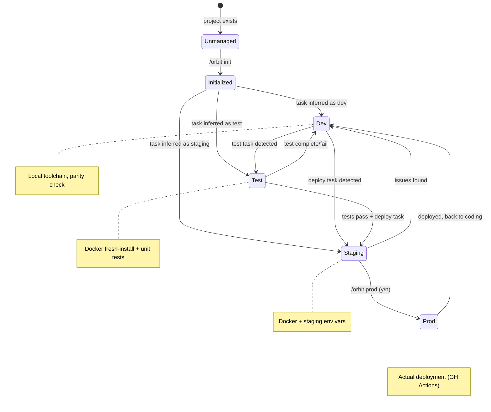

# Orbit: Master Plan (Revised)

## Overview

**Orbit** is an ambient dev environment management system for `~/Source/`. It uses a **hybrid architecture** (MCP Server + Claude Skill) to provide automatic environment management for vibe coders while giving power users explicit control.

**Architecture**: MCP Server (background daemon) + `/orbit` Skill (explicit control)

**Target Users**: Vibe coders who want envs to "just work"

**Project Types**: Node.js, Python, Go, Rust (skip iOS/visionOS for now)

---

## State Machine



---

## Phase 0: Installation & Enforcement

**Goal**: First-time setup, inject protocol so agents use Orbit automatically

### Triggers
- User runs install script
- AgentReverse installation

### Actions
1. Create `~/.orbit/` global directory
2. Initialize `config.json`, `registry.json`, `state.db`
3. **Inject enforcement protocol** into `~/.claude/CLAUDE.md`:

```markdown
## Environment Management (MANDATORY)

All environment tasks MUST use the Orbit system.

- Orbit MCP server monitors your tasks and auto-manages environments
- Use `/orbit status` to see current state
- Use `/orbit init` in new projects
- Use `/orbit use <env>` to override auto-inferred environment
- Do NOT run raw `docker` commands unless Orbit is insufficient
```

4. Add MCP server config to `~/.claude/.mcp.json`

### Files Created
```
~/.orbit/
├── config.json      # Global env definitions
├── registry.json    # Project tracking
└── state.db         # Audit log (empty schema)
```

---

## Phase 1: Foundation - Configuration

**Goal**: Establish environment conventions and defaults

### config.json

```json
{
  "version": "1.0.0",
  "environments": {
    "dev": {
      "description": "Local development",
      "docker": false,
      "parityCheck": true
    },
    "test": {
      "description": "Docker fresh-install + unit tests",
      "docker": true,
      "cacheDefault": true
    },
    "staging": {
      "description": "Docker with staging env vars",
      "docker": true,
      "mimic": true
    },
    "prod": {
      "description": "Production deployment",
      "docker": false,
      "requiresConfirmation": true,
      "triggersGitHubAction": true
    }
  },
  "defaults": {
    "node": "20",
    "python": "3.11",
    "go": "1.21",
    "rust": "1.75"
  },
  "taskClassification": {
    "model": "haiku",
    "pollInterval": 5000
  }
}
```

### state.db Schema

```sql
CREATE TABLE audit_log (
  id INTEGER PRIMARY KEY,
  timestamp TEXT NOT NULL,
  project TEXT NOT NULL,
  command TEXT NOT NULL,
  environment TEXT,
  duration_ms INTEGER,
  git_commit TEXT,
  success INTEGER,
  error_message TEXT
);

CREATE TABLE project_state (
  project TEXT PRIMARY KEY,
  current_env TEXT,
  last_activity TEXT,
  sidecars_running TEXT  -- JSON array
);
```

---

## Phase 2: Project Detection & Init

**Goal**: `/orbit init` to onboard projects

### Detection Logic (file-based)
| File Found | Inferred Type |
|------------|---------------|
| package.json | node |
| requirements.txt / pyproject.toml | python |
| go.mod | go |
| Cargo.toml | rust |
| Package.swift | swift (marked unsupported) |
| *.xcodeproj | xcode (marked unsupported) |

### /orbit init Flow

1. Auto-detect project type
2. Show detection + ask user to confirm
3. Create `.orbit/` folder in project:

```
<project>/
└── .orbit/
    └── config.json
```

4. Project config:

```json
{
  "type": "node",
  "sidecars": [],
  "testCommand": "npm test",
  "buildCommand": "npm run build",
  "supported": true
}
```

5. Register in global `~/.orbit/registry.json`
6. Log to audit

### Sidecar Declaration

User edits `.orbit/config.json` to add sidecars:

```json
{
  "sidecars": ["postgres", "redis"]
}
```

---

## Phase 3: Docker Infrastructure

**Goal**: Dockerfiles and compose for test/staging envs

### Directory Structure

```
~/.orbit/docker/
├── node.dockerfile
├── python.dockerfile
├── go.dockerfile
├── rust.dockerfile
└── docker-compose.yml
```

### docker-compose.yml

```yaml
version: '3.8'

services:
  # Project test runners
  test-node:
    build:
      context: ${PROJECT_PATH}
      dockerfile: ${ORBIT_ROOT}/docker/node.dockerfile
    profiles: ["node"]
    environment:
      - NODE_ENV=test
    depends_on: ${SIDECARS:-[]}

  test-python:
    build:
      context: ${PROJECT_PATH}
      dockerfile: ${ORBIT_ROOT}/docker/python.dockerfile
    profiles: ["python"]
    depends_on: ${SIDECARS:-[]}

  # Sidecars (lazy-loaded)
  postgres:
    image: postgres:15-alpine
    profiles: ["sidecar-postgres"]
    environment:
      POSTGRES_PASSWORD: orbit_test
    ports:
      - "5432:5432"

  redis:
    image: redis:alpine
    profiles: ["sidecar-redis"]
    ports:
      - "6379:6379"
```

### Dockerfile Template (Node)

```dockerfile
FROM node:${NODE_VERSION:-20}-alpine
WORKDIR /app
COPY package*.json ./
RUN npm ci
COPY . .
RUN npm run build --if-present
CMD ["npm", "test"]
```

### Flag Support
- Default: use cached layers
- `--fresh`: `docker-compose build --no-cache`

---

## Phase 4: MCP Server - Task-Aware Env Manager

**Goal**: Background daemon that watches tasks, infers env, manages Docker

### MCP Server Structure

```
orbit-mcp/
├── package.json
├── src/
│   ├── index.ts           # MCP server entry
│   ├── taskWatcher.ts     # Polls/watches TaskList
│   ├── classifier.ts      # LLM task → env classification
│   ├── dockerManager.ts   # Start/stop containers
│   ├── stateDb.ts         # SQLite operations
│   └── tools/
│       ├── status.ts      # orbit_status tool
│       ├── switchEnv.ts   # orbit_switch_env tool
│       └── getState.ts    # orbit_get_state tool
```

### Task Classification

```typescript
// classifier.ts
async function classifyTask(taskSubject: string): Promise<Environment> {
  const prompt = `Classify this task into an environment:
  Task: "${taskSubject}"

  Environments:
  - dev: coding, implementing, refactoring, fixing bugs
  - test: running tests, testing, verifying, checking
  - staging: preparing release, pre-deploy checks
  - prod: deploying, releasing, shipping

  Return only: dev|test|staging|prod`;

  return await llm.complete(prompt); // Use Haiku for speed/cost
}
```

### Exposed MCP Tools

| Tool | Description |
|------|-------------|
| `orbit_status` | Current env, running containers, recent audit |
| `orbit_switch_env` | Force switch to specified env |
| `orbit_get_state` | Raw state.db query |
| `orbit_start_sidecars` | Manually start sidecars |
| `orbit_stop_all` | Stop all Orbit containers |

### Auto-Management Logic

```
On task change:
  1. Get current active task
  2. Classify task → env
  3. If env changed:
     a. If ambiguous → prompt user via AskUserQuestion
     b. Stop current env containers
     c. Start new env containers
     d. Start sidecars if needed (lazy)
     e. Log to audit
```

---

## Phase 5: /orbit Skill (Explicit Control)

**Goal**: Human-friendly commands for when auto isn't enough

### File: `~/.claude/commands/orbit.md`

```markdown
---
name: orbit
description: Manage dev/test/staging/prod environments
---

# Orbit Environment Manager

## Commands

### /orbit status
Show current environment state, running containers, recent activity

### /orbit init
Initialize Orbit for current project (auto-detect type, create .orbit/)

### /orbit test [--fresh]
Run Docker fresh-install test. Use --fresh to skip cache.

### /orbit staging
Switch to staging environment (Docker with staging vars)

### /orbit prod
Deploy to production (requires y/n confirmation)

### /orbit use <env>
Override auto-inferred environment (dev|test|staging)

### /orbit sidecars
Show/manage sidecar status

### /orbit logs
Show recent audit log entries
```

### Skill Implementation Notes

- Skill calls MCP tools (`orbit_status`, etc.)
- `/orbit init` uses AskUserQuestion for type confirmation
- `/orbit prod` uses AskUserQuestion for y/n

---

## Phase 6: Workspace & Polish

**Goal**: Multi-project support, parity checks, GitHub integration

### Monorepo/Workspace Detection

If `package.json` has `workspaces` or `pnpm-workspace.yaml` exists:
- Register as workspace in registry
- Track sub-projects
- Coordinate sidecar sharing

### Version Parity Check

On `dev` env activation:
1. Read project's `.orbit/config.json` for expected versions
2. Check local toolchain versions
3. Warn if mismatch:
   ```
   ⚠️ Parity warning: Project expects Node 20, you have Node 18
   ```

### GitHub Actions Templates (Optional)

```
~/.orbit/templates/
├── ci.yml           # Basic CI (build + test)
└── release.yml      # Release workflow
```

`/orbit init` can optionally copy these to `.github/workflows/`

---

## Phase 7: Production Deployment (Cloud)

**Goal**: Deploy to cloud providers via GH Actions or direct CLI

### Supported Providers (Initial)
- **Vercel** - `vercel deploy` or GH Actions
- **Railway** - `railway up` or GH Actions

### Per-Project Config (`.orbit/config.json`)

```json
{
  "type": "node",
  "prod": {
    "provider": "vercel",
    "method": "cli",
    "project": "my-app"
  }
}
```

Or for GH Actions:

```json
{
  "prod": {
    "provider": "railway",
    "method": "github-actions"
  }
}
```

### /orbit prod Flow

1. User runs `/orbit prod` or task inferred as deploy
2. Orbit asks: "Deploy to [provider]? (y/n)"
3. If `method: "cli"`:
   - Run `vercel deploy --prod` or `railway up`
4. If `method: "github-actions"`:
   - Ensure workflow exists in `.github/workflows/`
   - Push to trigger workflow (or manual trigger)
5. Log to audit

### GH Actions Templates

```
~/.orbit/templates/
├── vercel-deploy.yml
└── railway-deploy.yml
```

---

## Deferred (Future)

- **AWS ECS, Azure** - more complex, enterprise-focused
- **LocalStack** - AWS staging mimics
- **iOS/Xcode** - Xcode Cloud, TestFlight
- **Secrets Management** - 1Password CLI

---

## Summary: What Gets Built

| Component | Type | Purpose |
|-----------|------|---------|
| `~/.orbit/` | Directory | Global config, registry, state.db |
| `orbit-mcp` | MCP Server | Background task watcher, auto-management |
| `/orbit` | Claude Skill | Explicit user commands |
| `.orbit/` | Per-project | Project-specific config, sidecar declarations |
| Dockerfiles | Templates | Fresh-install test containers (sandbox) |
| Deploy templates | GH Actions | Vercel/Railway deployment workflows |
| Enforcement | CLAUDE.md injection | Ensures agents use Orbit |

## Phase Summary

| Phase | Goal | Key Output |
|-------|------|------------|
| 0 | Installation | Global `.orbit/`, CLAUDE.md enforcement |
| 1 | Foundation | config.json, registry.json, state.db |
| 2 | Project Init | `/orbit init`, per-project config |
| 3 | Docker | Dockerfiles, compose, sidecars (sandbox) |
| 4 | MCP Server | Task watcher, LLM classifier, auto-envs |
| 5 | Skill | `/orbit status/test/staging/prod/use` |
| 6 | Workspace | Monorepo support, parity checks |
| 7 | Cloud Deploy | Vercel/Railway via CLI or GH Actions |
